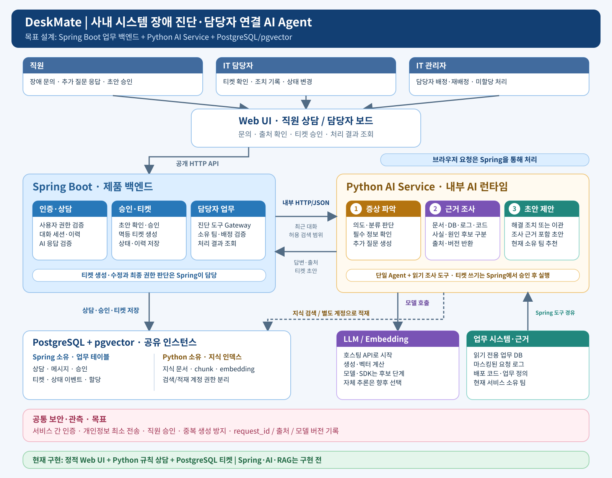
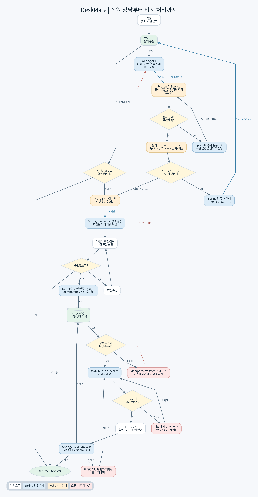

# DeskMate — 사내 시스템 장애 진단 및 담당자 연결 AI Agent

목표는 직원 문의 → 문서·DB·로그·코드 근거 조사 → 직원 해결 안내 또는 승인 후 담당 팀 이관 → 처리 상태 추적입니다. 현재 실행 가능한 앱은 규칙 기반 IT 상담과 티켓 데모이며 시스템 진단은 설계 단계입니다. [시스템 진단 설계](docs/investigation-design.md)에서 매출 수치 오류 시나리오와 필요한 도구·데이터를 확인하세요.

## 실행

Python 3.12 이상, uv, Docker Compose를 사용합니다. 티켓 DB는 PostgreSQL + pgvector입니다. 규칙 기반 상담은 API 키 없이 동작합니다.

```bash
cd /workspace/hanwha_final
UV_CACHE_DIR=/workspace/.cache/uv uv sync
cp .env.example .env
# .env에서 POSTGRES_PASSWORD를 임의의 로컬 비밀번호로 바꾸면 DATABASE_URL도 같은 비밀번호로 수정
docker compose up -d db
uv run python scripts/migrate.py
uv run python scripts/import_sqlite_tickets.py
uv run python server.py
```

브라우저에서 실행 머신의 8000번 포트로 접속합니다. 기본 바인딩은 `127.0.0.1`입니다. `PORT` 환경 변수로 포트를 변경할 수 있습니다.

## 현재 실행 가능한 데모 시나리오

1. **VPN 연결 장애** 버튼을 눌러 증상을 접수합니다.
2. 에이전트가 세 단계 해결 가이드를 제시합니다.
3. **미해결 · 티켓 접수**를 눌러 IT 번호와 장애 분류를 확인합니다.
4. 오른쪽 목록에서 상태를 **처리 중**, **해결**로 변경합니다.
5. 새로고침 또는 서버 재시작 후에도 티켓이 유지되는 것을 확인합니다.

## 구현 범위와 확장

현재 상담은 키워드 기반 규칙 데모이며 실제 LLM을 호출하지 않습니다. VPN·계정·메일·프린터 가이드를 제공합니다. 티켓은 PostgreSQL에 저장하며 Docker Compose 서비스가 필요합니다. 기존 SQLite 데이터는 `scripts/import_sqlite_tickets.py`로 가져오고 원본 `.local/tickets.db`는 변경하지 않습니다. `/api/chat`, `/api/tickets`, `/api/tickets/{id}`가 UI와 시스템을 연결합니다. 목표 설계는 Spring Boot 제품 백엔드와 Python AI Service를 분리합니다. [아키텍처 문서](docs/architecture.md)와 [상세 설계](설계/플로우차트_및_아키텍처.md)를 참고하세요.

인증과 사용자별 접근 제어는 구현되지 않았습니다. 로컬 발표용으로 사용하고 사내 운영 전에는 인증, 권한, 감사 로그, 개인정보 처리와 입력 보호를 추가해야 합니다. 외부 폰트를 불러오지 못해도 기본 글꼴로 동작합니다.

## Codex 개발 플러그인

OpenAI Developers와 Plugin Eval의 프로젝트 전용 설치 설정을 제공합니다. 저장소 루트에서 `bash scripts/setup-codex-plugins.sh`를 실행한 뒤 Codex를 재시작하세요. 요구 사항과 검증 범위는 [.agents/plugins/README.md](.agents/plugins/README.md)를 참고하세요.

## 프로젝트 진행 스킬

PRD, 요구사항 명세, 아키텍처, DB 설계·생성, API 명세, AI 평가, 테스트·배포용 스킬과 템플릿은 [.agents/skills/README.md](.agents/skills/README.md)에 정리되어 있습니다. Codex에 원하는 작업을 요청하면 `AGENTS.md`의 단계별 지침에 따라 필요한 스킬을 사용합니다. 스킬 추가 자체로 제품 문서나 실제 DB가 생성되는 것은 아닙니다.

AI Agent MVP의 목표는 PostgreSQL 17 + pgvector 기반 RAG입니다. 티켓 API는 PostgreSQL로 전환했으며 RAG와 실제 LLM 호출은 아직 구현하지 않았습니다. 아키텍처·DB schema·migration은 [DB 설계서](docs/database.md), [초기 migration SQL](db/migrations/001_initial_schema.sql), [구현 계획](docs/implementation-plan.md)을 확인하세요. `.env`의 비밀번호를 변경한 뒤 migration을 실행하고 서버를 시작합니다. 로컬 PostgreSQL은 `docker compose down`으로 멈출 수 있으며 데이터 보존 볼륨을 삭제하는 `down -v`는 사용하지 마세요.

LLM 선택과 학습 데이터의 현실성은 [LLM 선택과 데이터 전략](docs/llm-strategy.md)에 기록되어 있습니다.

## 아키텍처

현재 구현과 목표 혼합 구성을 구분한 [아키텍처 문서](docs/architecture.md), [업무 워크플로우 설계](설계/플로우차트_및_아키텍처.md)와 그림입니다.



[확대 가능한 SVG 원본](docs/project-architecture.svg)


