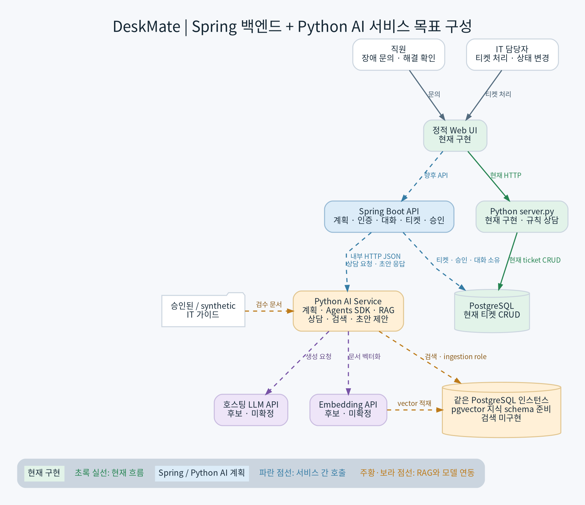
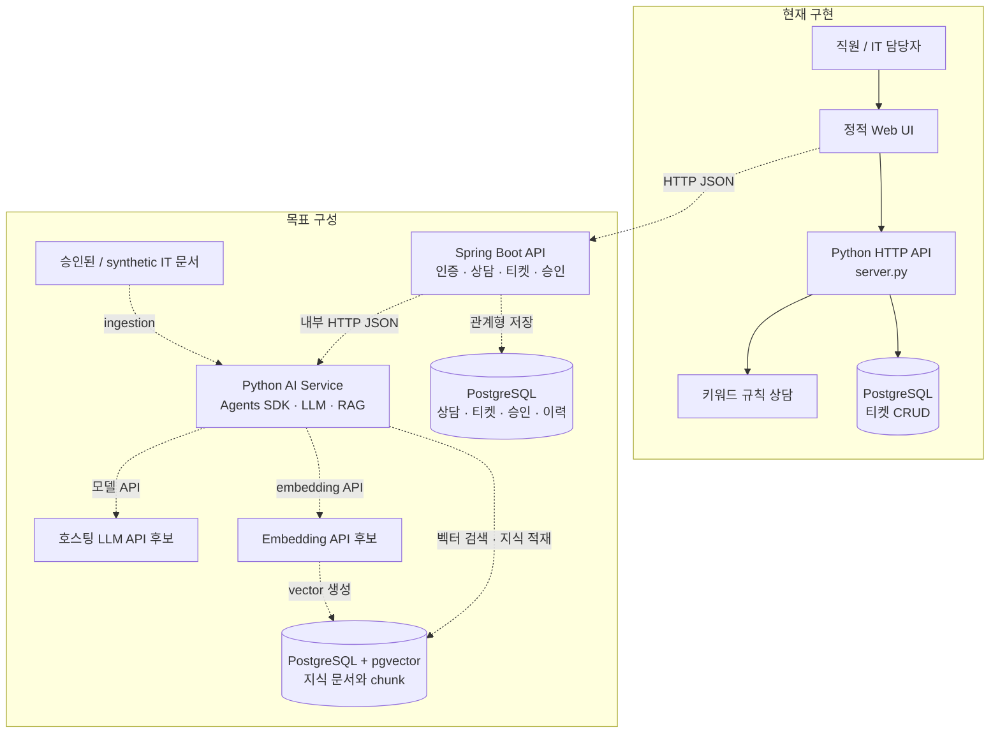
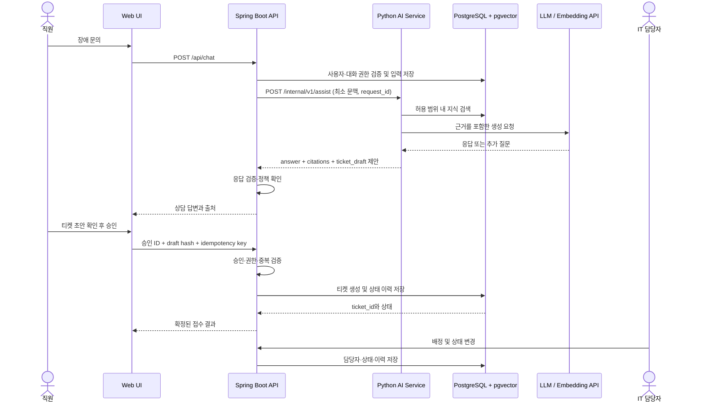

# DeskMate 목표 아키텍처

## 설계 방향

현재 앱은 Python HTTP 서버, 정적 웹 UI, 규칙 기반 상담, PostgreSQL 티켓 저장으로 동작한다. 목표는 **Spring Boot를 제품 백엔드로 두고 Python 서비스를 AI 전용 런타임으로 분리**하는 혼합 구성이다. 이 문서는 설계안이며, Spring 이관·LLM·RAG는 아직 구현되지 않았다.

초록 실선은 현재 구현, 파란 점선은 계획된 서비스 흐름, 주황 점선은 데이터 적재 경로다.

## 서비스 책임과 경계

| 구성 | 책임 | 권한 경계 |
|---|---|---|
| Web UI | 직원 상담, 근거 확인, 티켓 초안 검토·승인, 담당자 보드 | 브라우저 입력은 신뢰하지 않음 |
| Spring Boot | 인증·인가, 대화/요청 관리, AI 호출, 티켓·승인·상태·담당자 업무 규칙, PostgreSQL 관계 데이터 | 티켓 쓰기와 최종 권한 판단의 유일한 소유자 |
| Python AI Service | OpenAI Agents SDK 기반 상담, 추가 질문, 요약·분류, RAG 검색, 근거와 티켓 초안 반환, embedding ingestion | 티켓 쓰기·사용자 권한 결정 권한 없음 |
| PostgreSQL + pgvector | Spring 소유의 상담·승인·티켓 데이터와 Python AI 소유의 지식 문서·벡터 | 서비스별 최소 권한 DB role을 분리하는 목표 |
| 외부 모델 API | 생성 및 embedding 계산 | 필요한 최소 입력만 전송하고 민감 정보는 사전 제거·정책 적용 |

첫 데모는 한 PostgreSQL 인스턴스를 공유하되 테이블 소유권과 DB role을 분리한다. Spring은 상담·승인·티켓 테이블을 읽고 쓴다. Python은 지식 테이블을 검색하고 ingestion 계정으로만 적재한다. Python에는 ticket 테이블 쓰기 권한을 부여하지 않는다. 스키마 변경은 버전 관리 migration으로 적용하고, 어느 서비스가 migration을 소유할지는 구현 단계에서 확정한다.

AI 서비스에 보내는 사용자 문맥은 필요한 최근 대화, 요청 ID, 검색 범위 등으로 제한한다. 인증 주체와 허용 지식 범위는 Spring이 결정해 전달하며, Python은 클라이언트가 보낸 임의의 role·승인 여부를 권한 근거로 사용하지 않는다. 모델 출력은 제안이며 Spring에서 schema와 정책을 검증한다.

## 상담 API 계약 초안

Spring에서 Python으로 보내는 내부 요청은 `POST /internal/v1/assist`를 제안한다. 외부 공개 API는 Spring만 제공한다.

| 필드 | 방향 | 설명 |
|---|---|---|
| `request_id` | Spring → Python | 추적·중복 관찰을 위한 UUID |
| `conversation_id` | Spring → Python | 대화 상관관계 ID; Python은 영속 대화 저장소로 취급하지 않음 |
| `messages` | Spring → Python | 필요한 범위의 최근 상담 내용만 전달 |
| `knowledge_scope` | Spring → Python | 서버가 계산한 검색 허용 범위 |
| `answer` | Python → Spring | 사용자에게 보여 줄 응답 |
| `citations` | Python → Spring | 출처 ID·문서 버전·근거 구절 목록 |
| `ticket_draft` | Python → Spring | 제목·분류·사실 기반 요약 등 제안; 확정 티켓이 아님 |
| `needs_more_info` | Python → Spring | 추가 질문 필요 여부와 빠진 정보 목록 |

JSON schema, 최대 입력 크기, timeout, 인증 방식, 오류 code는 API 계약 단계에서 확정한다. 모델 응답 원문이나 chain-of-thought는 계약에 포함하지 않는다. 내부 통신 인증과 TLS는 배포 환경에 맞게 구현한다.

## 요청 흐름

AI 응답이 timeout 또는 오류이면 Spring은 실패를 분명히 반환하고 티켓을 생성하지 않는다. 재시도는 읽기/생성 응답에 한정하고 제한 횟수와 요청 ID를 기록한다. 티켓 생성은 Spring만 수행하며 idempotency key로 중복을 막는다. 티켓 생성 또는 담당자 배정 결과가 불명확하면 상태를 조회해 확인하고, 성공을 추정해 재생성하지 않는다.

## 데이터 소유권과 배포

- **Spring 소유 데이터:** conversations, messages, approvals, tickets, ticket_events 및 향후 담당자 할당 데이터.
- **Python AI 소유 데이터:** knowledge_documents, knowledge_chunks, embedding index metadata. ticket 및 승인 테이블 쓰기는 금지.
- **공유 인프라:** PostgreSQL + pgvector 한 인스턴스로 시작하되 사용자 계정/권한과 migration 절차를 분리한다.
- **문서 ingestion:** 승인된 또는 synthetic 문서만 ingestion한다. 출처, 버전, 분류, 접근 범위를 metadata로 유지한다.
- **배포 단위:** Spring API와 Python AI Service를 독립 프로세스/컨테이너로 실행한다. 데모 환경에서는 Docker Compose 구성을 목표로 한다.
- **개발 환경:** Python은 `uv`와 `.venv`를 사용한다. Spring 빌드 도구와 버전은 팀 표준 확인 후 선택한다.

## 기술 후보와 미결정 사항

- Spring Boot: 주 제품 백엔드 후보. Java 팀 역량을 활용해 인증, 티켓, 승인, 상태와 할당 업무를 구현한다.
- Python: AI 전용 서비스. OpenAI Agents SDK 후보와 RAG·평가 도구를 사용하되 SDK·버전은 구현 시 확정한다.
- LLM 후보: `gpt-4.1-mini`; 계정·지역별 가용성·가격·도구 호출을 확인하기 전 미확정.
- Embedding 후보: `text-embedding-3-small`, 1536 dimensions; 한국어 검색 평가 후 확정.
- AI Agent의 Python tool은 지식 검색 같은 읽기 기능으로 제한하고 티켓 쓰기는 Spring에서 승인 후 실행한다.
- PostgreSQL + pgvector: 티켓 저장은 현재 사용 중, 지식 검색은 schema만 준비되어 있고 구현 전.
- 인증, 내부 서비스 인증, 지식 권한 범위, 실제 담당자 목록·배정 정책, 티켓 필드, migration 소유권, API schema 및 timeout은 미결정.
- 현재 Python 웹 서버의 기능을 Spring으로 옮긴 뒤 구형 `/api/*` 서버를 유지할지 종료할지 정한다. 장기적으로 두 서버가 같은 UI 요청을 동시에 처리하지 않도록 한다.

이 혼합 구성 제안의 대안과 결과는 [ADR 0001](adr/0001-spring-python-ai-service.md)에 기록했다.

## 단계별 구현 순서

1. 외부/내부 API 계약과 기존 기능의 회귀 평가 사례를 고정한다.
2. Spring API에 티켓·대화·승인 핵심 기능을 옮기고 기존 데이터와 상태 매핑을 보존한다.
3. Python AI Service의 health 및 `/internal/v1/assist` mock 응답을 구성하고 Spring 간 통신을 확인한다.
4. 승인된 synthetic 문서 ingestion과 pgvector 검색을 Python에서 구현한다.
5. 호스팅 LLM과 Agents SDK를 연결하고 출처가 포함된 응답·티켓 초안을 반환한다.
6. Spring에서 승인 경계, 멱등 티켓 생성, 담당자 할당·상태 변경을 구현한다.
7. 정상·추가 질문·검색 실패·AI timeout·미승인·중복·할당 실패를 평가하고 데모를 통합한다.

튜닝은 기준선 평가에서 반복 오류가 확인된 뒤 별도 판단한다. 현재 구현 상태와 데이터 후보 조사 결과는 [LLM 선택과 데이터 전략](llm-strategy.md), [데이터 후보 정리](../데이터%20후보/README.md), [목표 업무 플로우](../설계/플로우차트_및_아키텍처.md)를 참고한다.
