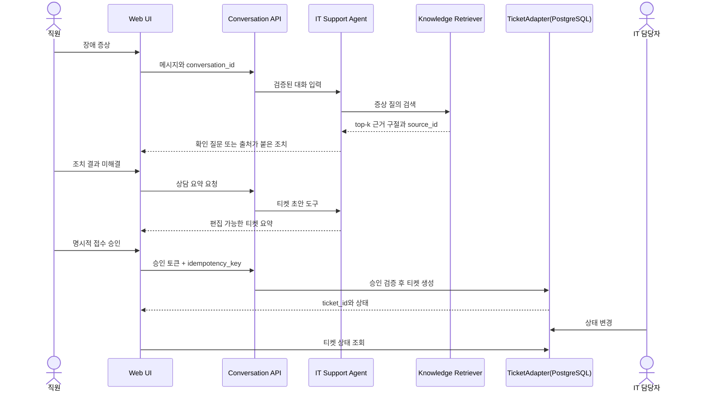

# DeskMate AI Agent 아키텍처 초안

## 기준선과 목표

**현재 구현:** Python HTTP 서버, 정적 웹 UI, 키워드 기반 `diagnose`, PostgreSQL + pgvector schema와 ticket API. 외부 LLM·embedding ingestion·RAG·인증은 없다.

**목표 시연 구조:** Python 웹 서버를 유지하며 상담 API에 OpenAI Agents SDK 단일 Agent를 추가한다. synthetic 지식 문서를 임베딩해 PostgreSQL + pgvector에서 검색하고, 명시적 schema가 있는 함수 도구를 호출한다. 티켓·대화·승인·지식 chunk를 PostgreSQL에 저장한다.

실제 LLM 모델과 embedding 모델은 설정 가능하게 두고, API key는 환경에서 읽는다. 실제 모델 이름·비용은 계정 접근 후 선택하며 여기서 가짜로 확정하지 않는다.

## 구성과 책임

- **Web UI:** 대화, 인용 출처, 상담 요약 편집, 명시적 티켓 승인, 담당자 보드.
- **Conversation API:** 입력 검증, 세션/요청 ID, Agent 호출과 응답 구조화.
- **IT Support Agent:** 증상 분류, 추가 질문, 검색·요약 도구 선택. 승인 전에 쓰기 도구 실행 불가.
- **Knowledge Retriever:** 문서 ingestion, chunk metadata, embedding 검색, top-k 출처 반환. 검색 결과는 신뢰하지 않는 참고 데이터.
- **TicketAdapter:** 승인된 ticket create, list/get, update status를 명확한 입력 schema와 멱등 키로 수행.
- **PostgreSQL + pgvector (목표 demo):** 티켓, 상담, 승인, 지식 chunk와 embedding을 저장. DB migration 및 pgvector 확장 활성화가 필요하다. 현재 SQLite 데이터는 migration 검증 전에 보존한다.
- **Evaluation harness:** 버전 고정 사례를 같은 retriever·agent·tools에 공급하고 결과와 trace를 산출.

## 요청 흐름

## 도구 경계와 오류

| 도구 | 권한 | 입력 | 부작용 | 실패 동작 |
| --- | --- | --- | --- | --- |
| `search_it_knowledge` | 읽기 | query, category | 없음 | 빈 결과·검색 오류를 구분해 반환 |
| `summarize_incident` | 읽기/변환 | 검증된 대화 요약 | 없음 | schema 검증 후 재요청 또는 fallback |
| `create_ticket` | 쓰기 | user-approved draft, approval ID, idempotency key | 티켓 생성 | 중복 key면 기존 ID, 오류면 상담 초안 유지 |
| `get_ticket` | 읽기 | ticket ID | 없음 | 미존재·권한 오류 구분 |
| `update_ticket_status` | 쓰기 | ticket ID, 허용 상태 | 상태/이력 변경 | 허용 전이 검증 후 명확한 오류 반환 |

Agents SDK의 모델 trace와 사용자에게 노출할 상담 기록은 분리한다. 인증 값, 불필요한 원문 개인 정보, chain-of-thought를 저장·출력하지 않는다. 사용자가 승인하기 전 ticket write 도구는 Agent에 노출하지 않거나 서버가 호출을 거부한다. UI 승인 boolean만 믿지 않고 서버 발급 승인 ID와 대화 draft hash를 확인한다.

## RAG와 데이터

1. synthetic Markdown 문서를 source ID·제목·분류·버전과 함께 ingestion한다.
2. 제목/문단 경계를 살려 chunk를 만들고 source metadata를 각 chunk에 유지한다.
3. embedding을 PostgreSQL pgvector의 `vector(1536)`에 저장하고 cosine distance top-k를 SQL로 검색한다. text-embedding-3-small은 현재 제안 설정이며 모델 차원 변경 시 schema와 index를 함께 교체한다.
4. 응답에 문서 제목·source ID·검색 구절을 전달하고, 평가 가능한 retrieval result를 남긴다.
5. embedding 교체 시 전체 문서를 재색인하고 index version을 기록한다. 검색 0건이면 안전 fallback한다.

## 관측과 보안

trace에 request/conversation ID, 단계, 도구 이름, 시간, 성공/오류 유형, source IDs, model/index version을 남긴다. 원문 민감 정보·API key·숨겨진 chain-of-thought는 기록하지 않는다. demo는 localhost bind를 유지하고 공개 배포에 인증 없이 노출하지 않는다.

## 기술 선택과 미결정 사항

- 유지: Python, uv, 정적 JS UI.
- DB 변경: SQLite에서 PostgreSQL + pgvector로 전환하는 것이 AI 기술 시연 MVP의 목표다. Docker Compose로 로컬 서비스를 준비한다.
- AI orchestration 후보: OpenAI Agents SDK. 실제 dependency 추가와 API 인증은 별도 작업으로 설정한다.
- Embedding: 초기 기준 후보는 OpenAI `text-embedding-3-small`(1536 dimensions). 실제 API 접근 후 비용·한국어 검색 품질을 검증하고 확정한다.
- retrieval: pgvector cosine 검색과 metadata 필터부터 구현한다. hybrid/재순위화는 평가 결과 후 결정한다.
- 실제 Jira/ServiceNow는 이번 MVP 밖이다. `TicketAdapter` 뒤에 외부 구현을 추가할 수 있도록 분리한다.
- 현재 데모 DB에 대화·출처·승인 이력이 없으므로 요구사항·마이그레이션을 확정한 뒤 별도 변경한다.
