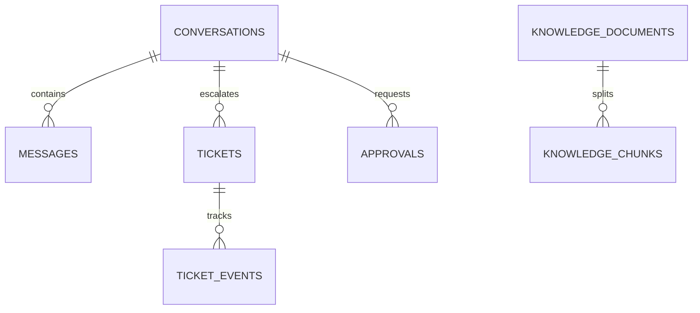

# DeskMate PostgreSQL·pgvector DB 설계 초안

## 엔진과 적용 범위

- **목표 시연 DB:** PostgreSQL 17 + pgvector 확장. Python 앱과 Docker Compose로 로컬 실행한다.
- **현재 상태:** 실제 앱은 아직 SQLite `.local/tickets.db`를 사용한다. 본 문서는 교체 전 설계이며 마이그레이션은 적용하지 않았다.
- **임베딩 기준 후보:** `text-embedding-3-small`, vector(1536). 실제 모델을 변경하면 차원과 기존 index 전체 재생성을 함께 조정한다.
- 목표 DB는 상담·티켓의 관계형 정합성과 지식 chunk 유사도 검색을 한 엔진에 모아 데모 운영을 단순하게 한다.

## ERD



## 주요 테이블

| 테이블 | 핵심 데이터 | 제약과 용도 |
| --- | --- | --- |
| conversations | 상담 ID, 생성·종료 시각 | 상담 흐름의 구분자 |
| messages | 역할, 본문, 분류, 시각 | 대화 이력. 실제 사용자 데이터 반입 전 개인정보 정책 필요 |
| approvals | draft hash, 승인 상태·시각 | 티켓 쓰기 도구의 사용자 승인 근거 |
| tickets | 상담 FK, 제목·분류·우선순위·상태·idempotency key | 같은 상담 재호출 중복 방지 |
| ticket_events | 이전/새 상태, actor, 시각 | 담당자 처리 추적 |
| knowledge_documents | source ID, 제목, 버전, 분류, 유효 여부 | 출처와 재색인 관리 |
| knowledge_chunks | 문서 FK, chunk 순서·본문·metadata·embedding | 근거 구절 검색, `vector_cosine_ops` 유사도 인덱스 |

사용자 identity/authentication은 현재 범위 밖이므로 가짜 직원 테이블은 만들지 않는다. 운영 도입 시 테넌트와 접근 권한 모델을 별도로 설계해야 한다.

## SQL 초안

초기 schema는 [001_initial_schema.sql](../db/migrations/001_initial_schema.sql)에 있다. `CREATE EXTENSION vector`, timezone-aware timestamps, PK/FK, CHECK, UNIQUE, 검색 vector 인덱스를 정의한다. 인덱스 설정은 테스트 corpus와 대상 pgvector 버전에서 확인 후 조정한다.

## 검색 쿼리 방향

```sql
SELECT id, document_id, chunk_text, metadata,
       1 - (embedding <=> $1::vector) AS cosine_similarity
FROM knowledge_chunks
WHERE metadata->>'category' = $2
ORDER BY embedding <=> $1::vector
LIMIT $3;
```

거리 기반 정렬과 vector operator index 활용 여부는 `EXPLAIN (ANALYZE, BUFFERS)`와 예상 corpus 규모에서 확인한다. 필요하면 category partial index, hybrid full text search, 재순위화를 측정 근거와 함께 추가한다.

## 데이터·보안 정책 초안

- timestamp는 `timestamptz`, 관계 키는 FK로 강제한다.
- 티켓 상태는 CHECK 제약으로 허용값을 제한하고 상태 변경은 `ticket_events`로 append한다.
- 지식 chunk에 원문 출처와 문서 버전을 유지한다. index version을 바꿀 때 구버전이 섞이지 않도록 재색인 단위를 명시한다.
- embeddings 자체에도 민감 문서의 의미 정보가 남을 수 있으므로 synthetic corpus만 사용한다.
- PostgreSQL 앱 접속은 parameterized SQL과 최소 권한 계정을 사용한다. 운영 적용 시 RLS 여부를 실제 인증·테넌트 모델과 같이 설계한다. 현재 데모에서 RLS를 켰다고 주장하지 않는다.
- DB 비밀번호는 환경 설정으로 전달하고 compose, 문서, 로그, Git에 고정 값을 저장하지 않는다.

## 적용 계획과 검증

1. PostgreSQL + pgvector 컨테이너를 로컬에서 기동하고 health check 확인.
2. 버전 관리된 migration runner로 빈 demo DB에 migration 적용.
3. pgvector extension·vector dimension·FK·CHECK·UNIQUE 생성 확인.
4. 합성 가이드 embedding 몇 건을 넣고 cosine nearest-neighbor 및 category 필터 검색 확인.
5. 상담·티켓 생성·idempotency·상태 이력 transaction 검증.
6. SQLite에서 전환할 경우 기존 데이터 백업 후 명시적 import, 행 수·ID·상태 대조. 기존 DB 삭제는 별도 확인 없이 하지 않는다.
7. compose volume에 실제 persistent data가 남는지 컨테이너 재생성으로 확인.

이 검증은 아직 실행되지 않았다. 현재 작업은 스키마·설계 초안만 작성했다.
