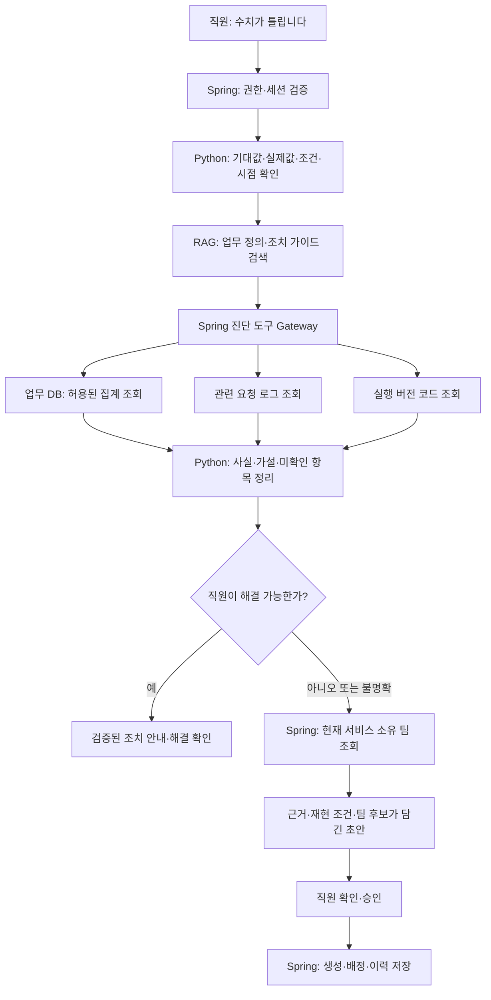

# 시스템 조사 및 담당자 연결 설계

## 제품 흐름

직원 문의 → Spring 인증/문맥 수집 → Python Agent 조사 계획 → 허용된 읽기 도구 실행 → 사실/가설 구분 → 직접 해결 안내 또는 승인 후 담당 팀 이관이다. 진단 기능은 아직 구현 전이다.

## 기술 책임

- Python은 단일 Agent로 질문, 조사 도구 선택, 근거 결합, 원인 후보, 해결/이관 제안을 담당한다. OpenAI API와 RAG를 사용한다.
- Spring은 인증·인가, service scope, 조사 도구 Gateway, 승인·티켓·소유 팀 목록을 소유한다. 도구 호출마다 권한과 입력을 재검증한다.
- Python이 직접 접근하는 DB는 DeskMate의 지식 인덱스다. 조사 대상 업무 DB는 별도 시스템이며 Spring Gateway의 읽기 전용 계정으로 연결한다. DeskMate 티켓 DB와 혼동하지 않는다.
- 실제 데이터 조회와 RAG를 구분한다. RAG는 정의/절차/코드 설명을 찾고, DB·로그 도구는 현재 또는 fixture 관측값을 반환한다. 최신 실행 코드는 배포 commit에 고정해 직접 조회한다.
- MVP에서 업무 데이터 수정이나 코드 실행 도구는 제공하지 않는다.

## 조사 도구 계약 초안

| 도구 | 주요 입력 | 반환 근거 | 제한 |
|---|---|---|---|
| `search_knowledge` | query, service scope | 문서 ID·버전·구절 | 허용 문서만 검색 |
| `inspect_metric` | service_id, metric_id, period, filters | 원천 집계·정의·snapshot ID | 등록된 query ID와 typed parameters만 사용; 모델 SQL 금지 |
| `get_request_logs` | service_id, request_id, time range | 마스킹된 이벤트·관측 시점 | 조회 기간·행 수·응답 크기 상한 |
| `get_code_context` | service_id, endpoint_id, deployed_commit | 허용 파일·함수·라인·commit | 등록 저장소와 배포 버전만; 임의 경로·명령 실행 금지 |
| `get_service_owner` | service_id, component_id | 현재 팀 ID·유효 기간·출처 | 미등록/충돌 시 unknown; 최초 작성자 자동 배정 금지 |

Python은 Spring 내부 API를 통해 위 도구를 호출한다. Spring이 사용자 권한에서 scope를 결정하며 model arguments의 사용자 ID나 role을 신뢰하지 않는다. `FORBIDDEN`, `NOT_FOUND`, `TIMEOUT`, `STALE_SNAPSHOT`과 빈 결과를 구분한다. 읽기 전용 DB 계정에 더해 승인된 조회 템플릿, parameterized SQL, row/time 제한을 적용한다.

최대 조사 횟수·시간·토큰 예산은 설정값으로 제한하고 초과 시 수집된 사실로 이관한다. 전문 조치가 명백하거나 범위 밖이면 모든 도구를 억지로 실행하지 않는다.

## 응답과 티켓 계약 확장

기존 `/internal/v1/assist` 응답에 다음 목표 필드를 추가한다. 정확한 OpenAPI/JSON schema는 구현 전 확정한다.

- `observed_facts`: fact ID, 값, evidence ID; 추정 원인을 포함하지 않는다.
- `hypotheses`: 후보 원인, supporting/refuting evidence IDs, 미확인 조건. 증거 없이 ‘확정’으로 출력하지 않는다.
- `evidence`: source type(document/query/log/code), source ID, observation time, snapshot/commit/version, 최소 근거 구절.
- `next_action`: 추가 질문 / 직원 조치 / 전문 담당 이관 / 조사 불가.
- `ticket_draft`: 기대값·실제값·재현 조건·영향·시도한 조치·근거·미확인 항목·서비스 ID·팀 후보. 후보는 Spring에서 재검증한다.

확인된 원인이라고 표현하려면 동일 snapshot 조건의 기대값 계산, 실제값, 실행 코드 경로와 재현 결과가 일치해야 한다. 그 외는 후보 또는 미확인으로 기록한다. 과신을 유발하는 근거 없는 백분율 confidence는 출력하지 않는다.

Spring이 초안을 저장하고 draft hash·승인 ID·멱등 키를 관리한다. 조사 도구 실행은 업무 DB 쓰기를 허용하지 않는다. 티켓 생성과 배정은 별도 결과로 기록하고, 배정 실패 시 이미 생성된 티켓을 다시 만들지 않는다.

## 데모 fixture 제작안

가상 `sales-demo` 서비스에서 단일 원화 주문 합계를 사용한다. 업무 정의에는 시간대, 조회 기간, 주문 상태, 취소 제외, 할인/환불 처리 방식을 명시한다.

| fixture | 설정 | 기대 동작 |
|---|---|---|
| FILTER-01 | 업무 정의와 다른 조회 조건으로 기대값과 차이 발생 | 조건 차이 근거 제시 → 직원 조건 수정 → 해결 확인 |
| LOGIC-01 | 같은 snapshot의 정상 주문 합계 1,000,000원, 잘못된 API 집계 900,000원 | 코드가 유효한 주문 100,000원을 제외한 근거 → 코드 수정 필요 후보 → 판매시스템 팀 이관 |
| UNKNOWN-01 | 로그 또는 배포 commit 확인 불가 | DB/코드 정상으로 단정하지 않고 미확인 항목 포함 이관 |
| DENIED-01 | 허용 범위 밖 데이터 요청 | 조회 거부 설명·권한 우회 금지 |
| OWNER-01 | 소유 팀 정보 없음 또는 충돌 | 직원 이름을 생성하지 않고 미할당 큐 접수 |

이는 제작할 fixture의 설계이며 실제 주문 데이터나 실행 증거가 아니다. 모든 fixture는 DB snapshot, API 결과, 코드 commit, 로그, 문서, owner registry와 gold evidence를 같은 버전에 묶는다. 코드의 마지막 수정자와 현재 소유 팀이 다른 사례도 넣는다.

## 필요한 데이터

1. 업무 정의·조치 가이드 12~20개: 기간/금액/상태 정의와 직원이 할 수 있는 조치, 전문 조치 경계를 포함한다.
2. 작은 합성 업무 DB와 정상/오류 API 출력: 가능한 모든 결과를 사람이 계산할 수 있게 유지한다.
3. 실행 코드 snapshot·관련 로그·API→함수 매핑: RAG 설명과 실제 배포 코드의 버전을 구분한다.
4. 가상 서비스 소유 팀 registry: team ID, 담당 범위, 유효 기간, 미할당 처리 정책.
5. 검수된 평가 60건: 개발 40·holdout 20; 각 사례에 허용 도구, 기대 근거, 금지 주장, 기대 해결/이관, 팀 ID를 기록한다.

공개 상담 후보는 증상 표현과 분류 보조에 사용한다. 현재 조사 대상의 DB 정답·코드 오류·담당 팀은 공개 데이터가 제공하지 않으므로 자체 제작해야 한다. Fine-tuning은 이 기준선의 오류 분석 후 검토한다.

## 구현 순서와 완료 기준

1. 계약·회귀 사례 고정 후 가상 매출 화면/API와 동일 버전의 주문·문서·코드·로그·소유 팀 자료 제작(D-01/02).
2. Spring 조사 Gateway: 허용 템플릿과 권한·조회 예산을 강제하고 거부/timeout을 구분(D-04).
3. Spring 제품 API: 기존 티켓 기능을 이관하고 AI 없이 초안 검토·승인·멱등 생성·팀 배정·담당자 처리 검증(D-03).
4. Python 문서 RAG 및 Agent: 문서 인용과 실제 관측 evidence로 사실/가설·직원 조치/전문 이관 구분(D-05).
5. 직원·담당자·관리자 화면 통합, 고정 평가와 팀원 실행 안내·발표 준비(D-06/07).

의존성과 구체 완료 기준은 [프로젝트 완성 로드맵](implementation-plan.md)을 따른다. 직원 해결과 담당 팀 이관 두 경로를 같은 버전에서 재현하고 승인 없는 생성·권한 밖 조회·미등록 담당자 생성·중복을 검증한다.

현재 문서만 구체화했으며 Spring Gateway, fixture 파일, 실제 조사 도구·모델 호출·배정은 구현/실행하지 않았다.

시연에서 사용할 사용자 역할과 구체적인 금액·조회 조건, 승인 및 이관 흐름은 [페르소나·시나리오·데모 가정](personas-and-demo-scenarios.md)에 정리한다.
