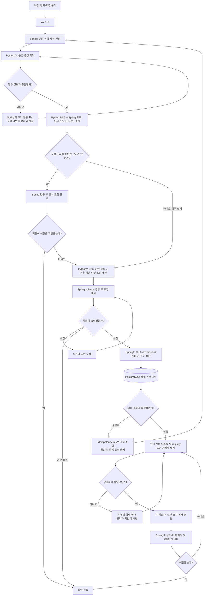
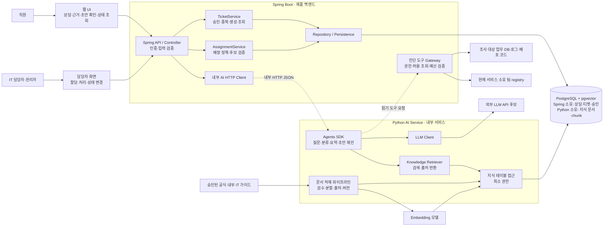
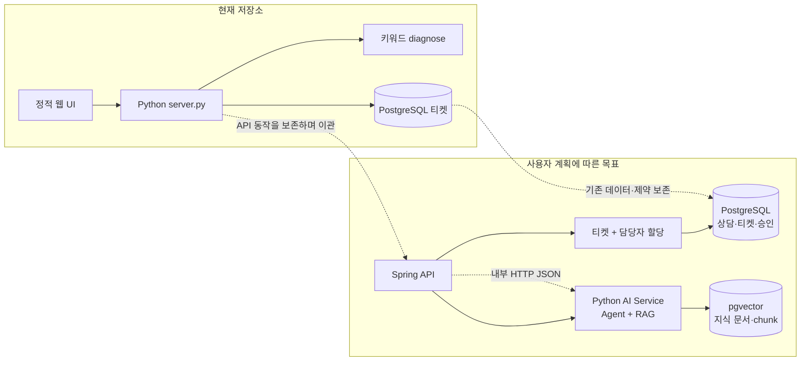
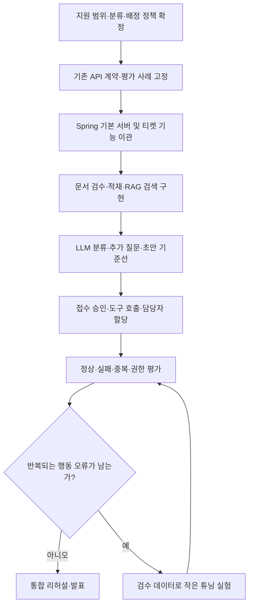

# DeskMate 업무 플로우차트와 시스템 아키텍처

작성일: 2026-10-08. Spring Boot 제품 백엔드와 Python AI 서비스 분리 구성을 목표로 설계한다. 현재 공개 저장소는 Python 규칙 기반 상담 및 PostgreSQL 티켓 생성·목록 조회·상태 변경이다. 아래 목표 설계는 구현 완료를 뜻하지 않는다.

저장소 확인 기준: `81199515cb2b5b41b37d54347ca790d98259d643`. [현재 코드](https://github.com/Jhanoo/hanwha_final/blob/81199515cb2b5b41b37d54347ca790d98259d643/server.py), [기존 아키텍처](https://github.com/Jhanoo/hanwha_final/blob/81199515cb2b5b41b37d54347ca790d98259d643/docs/architecture.md). 이번 작성에서는 추가 실행 검증을 하지 않았다.

한 장 요약은 [프로젝트 구조도](../docs/project-architecture.png)이며, 아래에 업무 흐름과 구성별 상세를 덧붙인다.

시스템 진단의 대표 사례와 도구·데이터는 [진단 설계](../docs/investigation-design.md)를 따른다. 문서 검색뿐 아니라 허용된 DB·로그·배포 코드 조회를 수행하고, 현재 소유 팀을 기준으로 연결한다.

## 1. 직원 상담부터 담당자 처리까지

이 그림은 목표 업무 흐름이다. 부족한 정보를 질문하고 근거가 없으면 해결책을 추측하지 않는다. 티켓 생성은 직원이 초안을 확인한 뒤 실행한다.

배정 방식은 미정이다. 자동 배정은 승인된 정책과 실제 후보 목록이 있을 때만 적용한다. 관리자가 선택하는 방식도 가능하다. 대화 모델이 임의의 직원이나 팀을 만들어 할당하지 않는다. 생성 실패·timeout의 결과 조회 경로는 앞으로 구현할 계약이며 현재 API가 이미 지원한다고 가정하지 않는다.

## 2. Spring 백엔드와 Python AI 서비스 목표 아키텍처

Spring Boot는 제품 API와 업무 규칙을 소유하고, Python은 AI 전용 내부 서비스로 둔다. Python AI Service가 OpenAI Agents SDK, LLM 호출, RAG 검색, embedding ingestion을 맡는다. Spring에서 승인·권한·티켓 쓰기를 통제하며 Python은 티켓 테이블을 변경하지 않는다. Web UI는 Spring API만 호출한다.

두 서비스는 내부 HTTP/JSON 계약으로 연결한다. Web UI는 Spring API만 호출한다. Controller는 HTTP와 인증, TicketService는 승인·업무 규칙·쓰기, AssignmentService는 배정 정책을 맡는다. Python AI Service는 Agent 실행, LLM 호출, Knowledge Retriever와 ingestion을 담당한다. AssignmentService는 논리적 책임의 이름이며 별도 서비스 클래스를 반드시 만들 필요는 없다.

모델 API로 나가는 정보는 해당 요청에 필요한 대화와 허용된 근거로 제한한다. 로그인 사용자·권한·승인 증명은 Spring의 신뢰된 문맥에서 가져온다. Spring은 검증된 검색 범위만 Python에 전달한다. 검색 문서나 모델 출력이 이를 대신 결정하지 않는다. Python은 ticket 테이블을 쓸 수 없고, 모델 출력의 티켓 초안은 제안으로만 처리한다.

### 내부 상담 API 초안

Spring → Python `POST /internal/v1/assist`를 제안한다. 요청은 `request_id`, `conversation_id`, 최소한의 최근 `messages`, Spring이 계산한 `knowledge_scope`를 포함한다. 응답은 `answer`, `citations`(출처 ID·버전·구절), `needs_more_info`, 선택적 `ticket_draft`(제목·분류·사실 기반 요약)다. 정확한 JSON schema, 오류 코드, 크기 제한과 timeout은 API 계약에서 확정한다. 인증 정보, 승인 토큰, idempotency key는 모델 입력에 넣지 않는다.

Spring은 AI 서비스 timeout·오류 시 티켓 쓰기를 하지 않고 명확한 오류를 반환한다. AI 요청의 재시도는 제한하며 `request_id`로 추적한다. 티켓 생성의 중복 방지와 승인 검증은 Spring에서만 수행한다.

### 구성별 책임

| 구성 | 책임 | 현재 상태 |
|---|---|---|
| 직원 UI | 문의, 추가 질문 응답, 초안 확인, 상태 조회 | 기존 정적 UI 존재; 목표 흐름 확장 필요 |
| 담당자 UI | 할당·재배정·처리 결과·상태 변경 | 상태 변경 데모 존재; 할당 기능 필요 |
| Spring API | 외부 API·인증·상담·티켓·승인 경계 | 사용자 목표, 현재 서버는 Python |
| Python AI Service | 정보 수집, 근거 설명, 검색, 분류·요약·티켓 초안 제안 | 실제 LLM 미구현 |
| Knowledge Retriever | 문서·제품·버전·접근 범위에 맞는 검색 | pgvector schema만 준비 |
| TicketService | 승인 검증, 멱등성, 저장 및 조회 | 기존 Python 기능을 계약 확인 후 이관 |
| 담당자 배정 기능 | 실제 후보와 정책을 검증해 할당 | 현재 API/DB에 계약 없음 |
| PostgreSQL | Spring의 업무 데이터와 Python의 지식 벡터 저장 | 티켓 저장 사용; 담당자 schema는 설계 필요 |
| LLM 및 embedding | 대화 생성과 문서 벡터화 | 선택·연결·평가 필요 |

## 3. 현재 구현과 목표의 차이

현재 엔드포인트는 POST /api/chat, GET·POST /api/tickets, POST /api/tickets/{id}, GET /api/health다. 단건 조회나 담당자 할당 엔드포인트를 이미 있는 것처럼 그리지 않는다. 목표 도구와 API는 실제 계약을 먼저 정의한다. 현재 API의 접수/처리 중/해결과 DB의 open/in_progress/resolved 매핑을 보존한다.

현재 create_ticket은 approved 레코드를 내부에서 생성하므로 Spring 이관 시 서버 검증이 있는 명시적 승인 경계로 확장해야 한다. 현재 idempotency key가 있어도 동시 생성 및 불명확한 결과 복구를 검증해야 한다. 담당자 저장 schema 및 migration은 이번 문서에서 변경하지 않았다. Python AI Service는 티켓을 직접 생성하지 않는다.

## 4. 프로젝트 개발 순서

튜닝은 필수 시작 단계가 아니다. 최신 지식 부족은 문서·검색을, 계약 오류는 tool schema와 서버를, 반복되는 질문·분류·요약 오류는 검수 데이터와 튜닝을 검토한다. 현재 데이터 후보에서 Console-AI·Tobi는 분류/초안, IT_Support_V2는 검수할 증상 표현, ko-agentic-sft는 행동 보조, FunctionChat는 독립 평가에 활용한다.

### 단계별 완료 기준

단계와 산출물 D-01~07은 [프로젝트 완성 로드맵](../docs/implementation-plan.md)을 기준으로 한다.

1. 계약·자료: 역할·API 계약·회귀 사례를 고정하고 가상 매출 시스템과 동일 snapshot의 주문·문서·코드·로그·현재 팀 자료를 제작한다.
2. Spring: 허용 조회·권한·예산을 검증하고 기존 데이터 보존, 승인·멱등 접수·팀 배정·담당자 처리를 AI 없이 확인한다.
3. Python AI: 실제 RAG와 Gateway 도구로 근거·사실/가설·안내/초안을 반환한다. 초기에는 OpenAI API를 사용하며 튜닝을 제외한다.
4. 통합: 직원·담당자·관리자 화면, 대표/실패 평가, 버전별 결과, Compose·실행 안내와 발표 자료를 준비한다.

튜닝은 기준선의 반복 오류와 데이터 이용 조건 확인 후 별도로 판단한다. 기존 규칙 상담·티켓 데모는 위 완료 기준을 충족한 것으로 표시하지 않는다.

## 미결정 사항 및 검증 범위

Spring 전환은 사용자 계획이며 이 문서는 목표안이다. 실제 AI 라이브러리·모델·담당자 정책·인증·추가 DB 필드·API 계약은 미확정이다. Mermaid 원문과 Markdown 구조를 검사했으며 실행 가능한 서비스, 렌더링 화면, 성능을 검증한 산출물은 아니다. 외부 메시지 발송·티켓 변경·코드 이관·DB migration은 수행하지 않았다.
